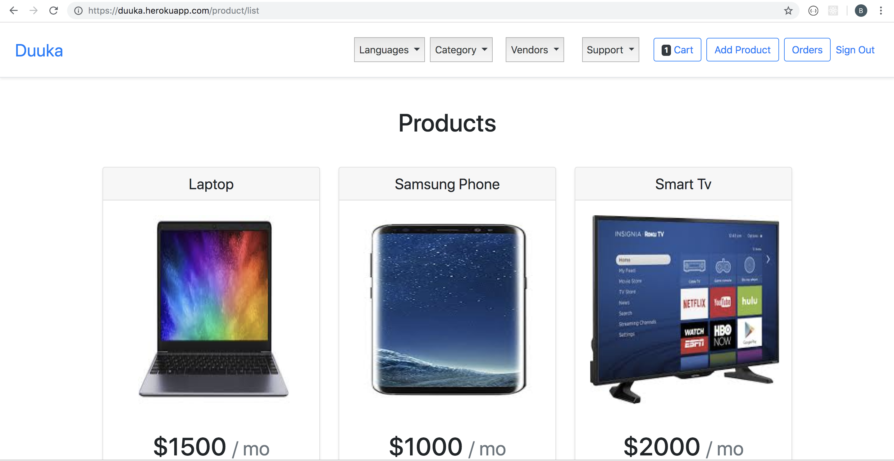

# E-Commerce
An e-commerce platform built using django

[](https://travis-ci.org/archibishop/E-Commerce)   [](https://coveralls.io/github/archibishop/E-Commerce?branch=develop)

# Getting Started
The following instructions will enable you run this project on your local machine.

# Prerequisites
You need to have python installed on your machine. If not got to https://www.python.org/downloads/ to get an installer for your machine. You should also install pip to your machine.
Then download a virtualenv using ``` pip install virtualenv.```

# Installation
Clone the project https://github.com/archibishop/E-Commerce.git and have a copy on your local machine. Create a virtual environment using ``` virtualenv env ``` command to create one in the folder.
Activate the virtual environment using ``` source\bin\activate ``` command and the then run
pip install -r requirements.txt. This will install the packages required for the project.
The project is now ready to use.

# Online
You can access the project online by following this [link](https://duuka.herokuapp.com/)

# Running the tests
Run this command ``` python manage.py test ``` to run tests.

# Built with 
Django, Bootstrap, Html, CSS

### Screenshot


